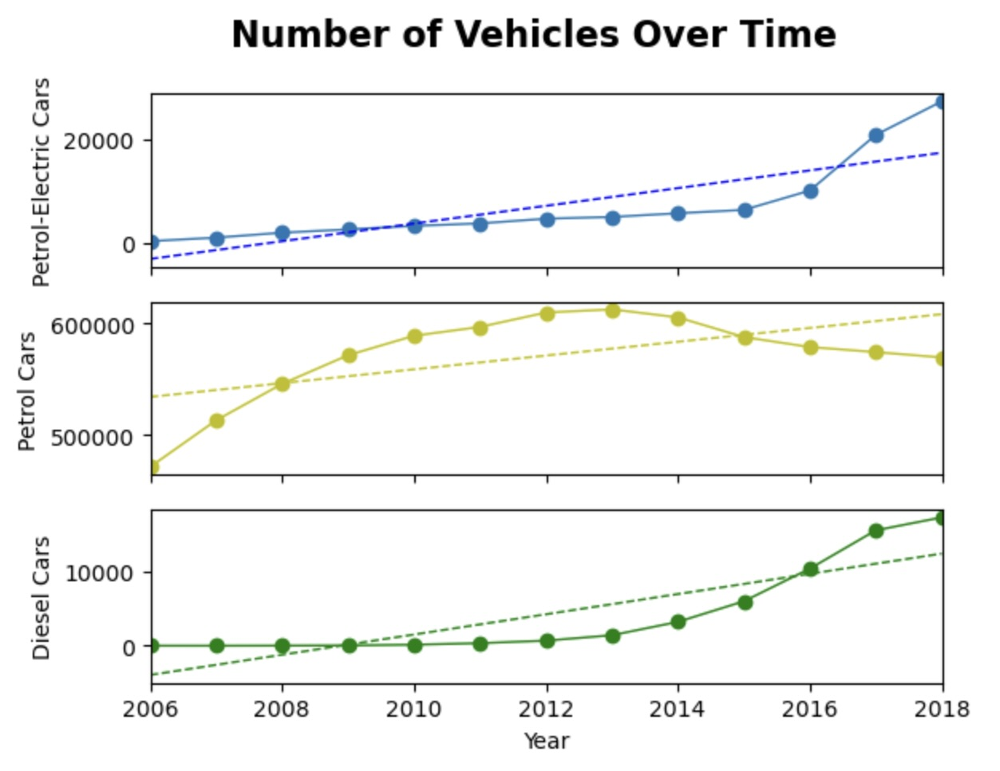

## Using the regression lines to predict what the number of petrol-electric, petrol, and diesel cars will be in 2024.

### The following steps were taken to achieve this goal:
* Use SciPy to fit data and Matplotlib to display the fit.
* Generate a scatter plot with Matplotlib using the year as the independent (*x*) variable and the number of petrol-electric cars as the dependent (*y*) variable.
* Use `stats.linregress` to perform a linear regression with the year as the independent variable (*x*) and the number of petrol-electric cars as the dependent variable (*y*).
* Use the information returned by `stats.linregress` to create the equation of a line from the model.
* Calculate the predicted number of petrol-electric cars of the linear model using the year as the *x* values.
* Plot the linear model of year versus number of petrol-electric cars on top of your scatter plot.
* Repeat the process of generating a scatter plot, calculating the linear regression model, and plotting the regression line over the scatter plot for the following pairs of variables:

  * Year versus number of petrol cars.

  * Year versus number of diesel cars.
* Use `pyplot.subplots` from Matplotlib to create a new figure that displays all three pairs of variables on the same plot. For each pair of variables, there should be a scatter plot and a regression line.

  * All three plots share the same x-axis.
* Use the regression lines created to predict what the number of petrol-electric, petrol, and diesel cars will be in 2024.

  

## References

Singapore Land Transport Authority. (2022). Annual Motor Vehicle Population by Type of Fuel Used. [https://data.gov.sg/dataset/annual-motor-vehicle-population-by-type-of-fuel-used](https://data.gov.sg/dataset/annual-motor-vehicle-population-by-type-of-fuel-used)

- - -

